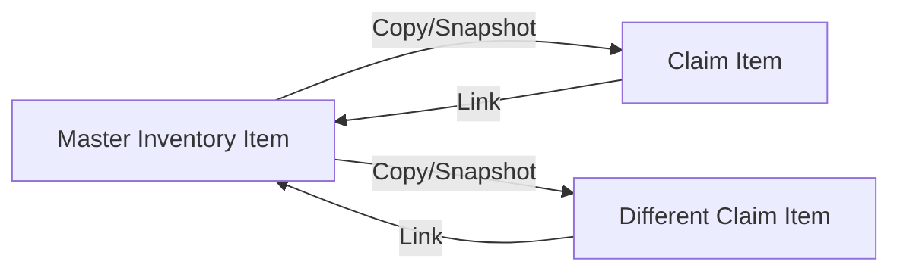

# Two-Layer Inventory Architecture

VeritasVault utilizes a **Two-Layer Inventory System** to ensure data integrity during the insurance claim process. This architecture separates the user's permanent asset record ("Master") from the specific snapshot used for a claim ("Claim").

## 1. Concept

### Layer 1: Master Inventory (Source of Truth)
*   **Definition:** The comprehensive, permanent database of all assets owned by the user.
*   **Mutability:** Editable by the user at any time during general housekeeping.
*   **Immutability Context:** **NEVER** modified directly by a Claim action. A claim cannot delete or alter a Master item's core attributes (e.g., Original Cost, Purchase Date).
*   **Storage:** `/inventory/master.json`

### Layer 2: Claim Inventory (Incident Snapshot)
*   **Definition:** A subset of items selected from the Master Inventory, specifically relevant to a single loss event (e.g., "Kitchen Fire").
*   **Behavior:** Acts as a **Snapshot**. When an item is added to a claim, its data is copied.
*   **Mutability:** Highly mutable *within the context of the claim*. 
    *   *Example:* A user might adjust the "Claimed Value" of a TV down to reflect depreciation for that specific claim, or change the description to "Total Loss - Water Damage". These changes **DO NOT** reflect back to the Master Inventory.
*   **Storage:** `/claims/{claim_id}/inventory_snapshot.json`

## 2. Data Relationship



*   **One-to-Many:** A single Master Item can exist in multiple Claims (e.g., a laptop claimed for repair in Claim A, and later claimed for theft in Claim B).
*   **Foreign Key:** The `ClaimItem` retains a `masterItemId` reference to allow for audit trails, but does not sync changes back automatically.

## 3. Virtual File System Structure

The application persists data using the following logical directory structure to enforce this separation:

```text
/root
├── inventory/
│   ├── master.json              <-- LAYER 1: Source of Truth (All items)
│   └── proofs/                  <-- Shared Evidence Locker (Blobs)
│       ├── receipt_001.pdf
│       └── photo_002.jpg
│
├── claims/
│   ├── {claim_id_1}/
│   │   ├── claim_meta.json      <-- Incident Details, Dates
│   │   ├── inventory.json       <-- LAYER 2: The Claim Snapshot (Filtered items)
│   │   └── generated_forms/     <-- PDFs generated from Layer 2
│   │
│   └── {claim_id_2}/
│       └── ...
│
└── policies/
    └── policy_data.json
```

## 4. Workflows

### Creating a Claim
1.  **Filter:** User filters Master Inventory (e.g., by Location or Category).
2.  **Snapshot:** System performs a deep copy of selected `InventoryItems` into `ClaimItems`.
3.  **Contextualize:** User edits `ClaimItem.claimDescription` (e.g., adds "Smoke damaged") and sets `ClaimItem.status`.
4.  **Master State:** The Master Item remains untouched.

### Deleting a Claim
1.  **Action:** User deletes `{claim_id}`.
2.  **Result:** The `inventory.json` inside the claim folder is destroyed.
3.  **Safety:** The Master Inventory is strictly unaffected.
